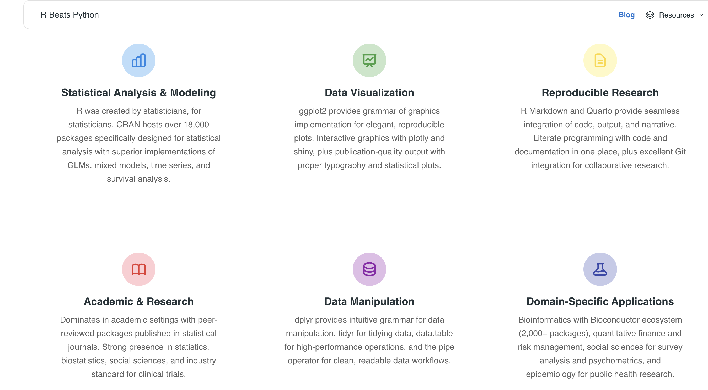
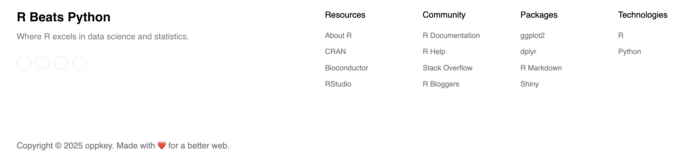

# Astro Template vs LLM Comparison

## 🌐 Live Demo

**View the live site:** [https://codetricity.github.io/astro-r-python/](https://codetricity.github.io/astro-r-python/)

## Project Overview

This repository serves as a **comparison study** between two different approaches to building web applications:

1. **Template-based approach**: Using the [Astro Launch UI Pro template](https://www.creative-tim.com/astro/launch-ui-pro/) from Creative Tim
2. **LLM-based approach**: Building from scratch using Gemini 2.5 Pro with only instructions and theme concepts

### Purpose

The goal is to evaluate the workflow efficiency, development speed, and final output quality when comparing:

- Working with a pre-built, professional template
- Starting from zero with AI assistance

### Comparison Repository

For the LLM-based approach example, see Jesse Casman's repository that demonstrates building an Astro site without using any template, relying solely on AI instructions and theme concepts.

### Limitations of Comparison

- I did not read the documentation for the template all in this test
- I had no experience with Astro
- I have limited experience with the underlying components, most importantly, I am weak in JavaScript syntax

## Key Findings

This comparison aims to explore:

- **Development Speed**: How quickly can you get a professional-looking site up and running?
- **Customization**: What are the trade-offs between template constraints and full creative control?
- **Maintenance**: How does ongoing development and updates differ between approaches?
- **Learning Curve**: Which approach is more accessible for different skill levels?

### Template vs LLM Insights

**Template Advantages:**

- Superior font choices and general layout compared to AI-generated designs
- Professional visual quality that's difficult to achieve from scratch, even with AI assistance
- Comprehensive component library and pre-built functionality

**Template Challenges:**

- Template is slightly outdated with older versions of key components like Astro
- More difficult for AI to work with due to template-specific conventions and structure
- Requires human understanding of template documentation to effectively guide AI
- Blog posts and index pages initially didn't leverage template components effectively

**AI Workflow Observations:**

- No specific rules were established for AI to use the template effectively
- Template constraints create a steeper learning curve for AI-assisted development
- Performance likely improves with continued template usage and better AI guidance

### Next Steps

- **Purchase Pro Version**: If pursuing this template-based approach, upgrade to pro version for additional features.  However, before purchasing
the pro license, I suggest looking at other templates.
- **Establish AI Rules**: Set up project-specific rules and documentation for AI to work effectively with the template
- **Human Learning**: Developer needs to learn template documentation and create/edit rules for AI assistance. When we used Sparrow and Front
with Bootstrap, our speed got better over time as we read more of the
documentation.
- **Template Integration**: Improve usage of template components across all pages (blog, index, etc.)

## Recommendations

At the current time, this type of layout with icons and fonts may be difficult to achieve without
a template.

In order to move forward quickly, we should try to work with the LLM from scratch without a template and
feed it styles from screenshots of what to build.

If we cannot match the style of a template, we should use a template.

This type of layout has also been difficult to replicate without AI.

## Resources

- **Template Source**: [Astro Launch UI Pro](https://www.creative-tim.com/astro/launch-ui-pro/)
- **Live Demo**: [https://codetricity.github.io/astro-r-python/](https://codetricity.github.io/astro-r-python/)
- **Astro Documentation**: [https://docs.astro.build/](https://docs.astro.build/)

## 👀 Information on Astro Launch UI Template

Feel free to check [our documentation](https://www.creative-tim.com/learning-lab/astro/overview/astro-launch-ui) or jump into our [Discord server](https://discord.com/invite/TGZqBvZB).

## About This Template

This repository contains the **template-based implementation** using the Astro Launch UI Pro template. The template provides:

- 70+ fully coded elements
- 3 fully coded example pages  
- 30+ blocks
- Responsive design
- Professional UI components

### Template Features

The Astro Launch UI template offers a comprehensive starting point with:

- Pre-built landing pages
- Product showcase components
- Shopping cart functionality
- Authentication flows
- Modern, responsive design

## 🧞 Commands

All commands are run from the root of the project, from a terminal:

| Command                | Action                                             |
| :--------------------- | :------------------------------------------------- |
| `npm install`          | Installs dependencies                              |
| `npm run dev`          | Starts local dev server at `localhost:3000`        |
| `npm run build`        | Build your production site to `./dist/`            |
| `npm run preview`      | Preview your build locally, before deploying       |
| `npm run astro ...`    | Run CLI commands like `astro add`, `astro preview` |
| `npm run astro --help` | Get help using the Astro CLI                       |
